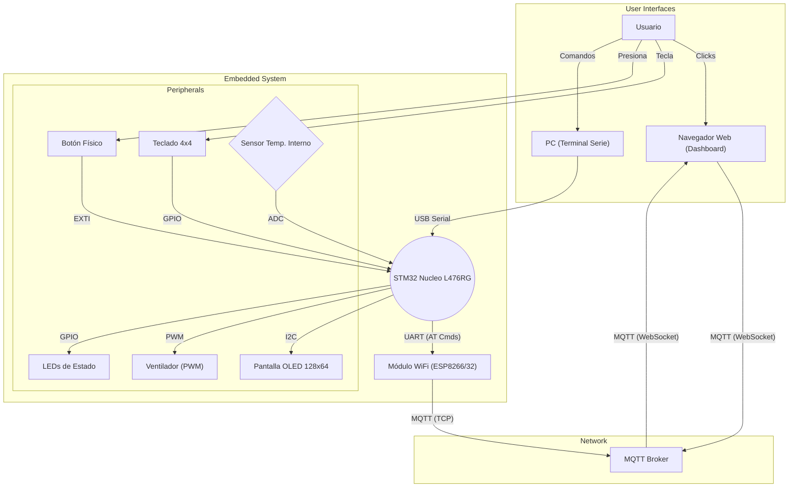

# Room Control System v2.0

## Overview

Este es un sistema de control de habitación basado en un microcontrolador STM32, diseñado como un proyecto de IoT completo. El sistema gestiona la seguridad de una puerta, el control ambiental y proporciona múltiples interfaces de usuario, incluyendo un teclado físico, una terminal de comandos en serie y un panel de control web remoto.

El firmware está construido sobre la capa de abstracción de hardware (HAL) de STM32, pero está estructurado con una capa de aplicación limpia y modular que gestiona toda la lógica del sistema. Esto permite una fácil expansión y mantenimiento.

## Features

-   **Control de Puerta Avanzado:**
    -   Bloqueo y desbloqueo seguro de la puerta.
    -   Desbloqueo temporal a través de un botón físico o un comando remoto.
    -   Desbloqueo permanente.
    -   Bloqueo automático después de un desbloqueo temporal.
-   **Múltiples Métodos de Acceso:**
    -   Teclado 4x4 para acceso con contraseña.
    -   Botón físico para anulación o cambio de estado.
    -   Panel de control web para control remoto completo.
-   **Control Ambiental:**
    -   Control de velocidad de un ventilador con 4 niveles (Off, Low, Med, High).
    -   Monitorización de la temperatura ambiente utilizando el sensor interno del STM32.
-   **Interfaz de Usuario y Monitorización:**
    -   Pantalla OLED para mostrar el estado del sistema en tiempo real (estado de la puerta, velocidad del ventilador, temperatura).
    -   Panel de control web basado en MQTT para monitorizar y controlar el sistema desde cualquier navegador.
    -   Terminal de comandos en serie (CLI) para depuración y control directo.
-   **Sistema Robusto y Seguro:**
    -   Modo de Emergencia que bloquea el sistema y maximiza el ventilador.
    -   Estado de "Acceso Denegado" que bloquea el teclado temporalmente tras un intento de contraseña fallido.
    -   Lógica no bloqueante en el bucle principal, utilizando interrupciones y buffers circulares para una comunicación eficiente.

## System Architecture

### Diagrama de Contexto

Este diagrama muestra las interacciones entre los componentes principales del sistema.



### Diagrama de Flujo del Programa

Este diagrama ilustra el flujo de ejecución principal del firmware del STM32, destacando la arquitectura de superloop no bloqueante y la gestión de interrupciones.

```mermaid
graph TD
    Start((Inicio)) --> InitHAL[Inicializar HAL y Reloj del Sistema]
    InitHAL --> InitPeriphs[Inicializar Periféricos HAL (GPIO, UART, I2C, ADC, TIM)]
    InitPeriphs --> InitAppLayer[Inicializar Capa de Aplicación (room_control_init)]
    InitAppLayer --> StartInterrupts[Iniciar Interrupciones (UART Receive, EXTI)]
    StartInterrupts --> Superloop{while(1)}

    Superloop --> Heartbeat[Procesar Heartbeat LED]
    Heartbeat --> KeypadPoll[ sondear teclado (keypad_poll)]
    KeypadPoll --> AppProcess[Llamar a room_control_process()]
    AppProcess --> Superloop

    subgraph "Proceso Asíncrono (Interrupciones)"
        HardwareEvent(Evento de Hardware: UART RX / Botón) -- "Interrupción" --> ISR[Interrupt Service Routine (ISR)]
        ISR -- "Escribe en" --> RingBuffer((Buffer Circular))
        RingBuffer -- "Leído por" --> AppProcess
    end
```

## Requisitos de Hardware y Software

-   **Hardware:**
    -   Placa de desarrollo STM32 Nucleo-L476RG.
    -   Pantalla OLED 128x64 (SSD1306).
    -   Teclado matricial 4x4.
    -   Módulo WiFi con firmware AT (e.g., ESP8266, ESP32).
    -   Botón pulsador.
    -   LED y motor DC (o ventilador) para el control PWM.
-   **Software:**
    -   STM32CubeIDE.
    -   Un broker MQTT (e.g., Mosquitto) instalado en la red local.
    -   Un navegador web moderno.
    -   Un cliente de terminal serie (e.g., PuTTY, TeraTerm).

## Estructura del Proyecto

El firmware está organizado con una clara separación de responsabilidades:

-   `Core/Inc`: Contiene los archivos de cabecera (`.h`), incluyendo `main.h`, los manejadores de HAL, y nuestros drivers de aplicación como `room_control.h`.
-   `Core/Src`: Contiene los archivos fuente (`.c`), incluyendo `main.c`, `stm32l4xx_it.c` (manejadores de interrupciones), y la implementación de nuestra aplicación `room_control.c`.
-   **Capa de Aplicación (`room_control.c`)**: Contiene toda la lógica del sistema, estados y reglas. Es independiente del hardware y utiliza funciones HAL para interactuar con los periféricos.

## Configuración y Uso

1.  **Broker MQTT:** Asegúrate de que tu broker Mosquitto esté corriendo en tu red. Para la interfaz web, debes habilitar el listener de WebSockets. Añade estas líneas a tu archivo `mosquitto.conf`:
    ```conf
    listener 1883
    listener 9001
    protocol websockets
    allow_anonymous true
    ```
2.  **Firmware:**
    -   Abre el proyecto (`.ioc` file) en STM32CubeIDE.
    -   Verifica que todos los periféricos (USART2, USART3, I2C1, ADC1, TIM3, GPIOs) estén configurados correctamente.
    -   Genera el código desde CubeMX.
    -   Construye y flashea el firmware en la placa Nucleo.
3.  **Interfaz Web:**
    -   Abre el archivo `app.js`.
    -   Modifica la constante `BROKER_URL` con la dirección IP y el puerto WebSocket de tu broker MQTT.
    -   Abre el archivo `index.html` en un navegador web.

## Referencia de Comandos (Terminal Serie)

La comunicación con el sistema a través de la terminal serie (USART2) se realiza con los siguientes comandos, terminados con la tecla Enter.

| Comando | Parámetros | Descripción (Inglés / Español) |
| :--- | :--- | :--- |
| `HELP` | - | Displays the command list. / Muestra esta lista de comandos. |
| `STATUS` | - | Returns the full system status. / Devuelve el estado completo del sistema. |
| `GET_TEMP` | - | Returns the current temperature. / Devuelve la temperatura actual. |
| `FAN` | `[level]` | Sets fan speed. Level can be 0-3 or 0, 25, 60, 100. / Fija la velocidad del ventilador. |
| `SETPASS` | `[new_pass]` | Changes the keypad access password. / Permite cambiar la contraseña de acceso. |
| `LOCK` | `[0\|1]` | 0=Unlock permanently, 1=Lock door. / 0=Desbloquea permanentemente, 1=Bloquea. |
| `REMOTE_OPEN` | - | Temporarily unlocks the door. / Desbloquea la puerta temporalmente. |
| `EMERGENCY` | `[0\|1]` | 0=Disable, 1=Enable emergency mode. / 0=Desactiva, 1=Activa el modo emergencia. |

## Mejoras Futuras

-   Implementar un parser robusto de comandos AT para gestionar las respuestas del módulo WiFi.
-   Guardar la contraseña y el estado del sistema en memoria no volátil (EEPROM o Flash).
-   Migrar el bucle principal a un sistema operativo en tiempo real (FreeRTOS) para gestionar las tareas.
-   Expandir la interfaz web con gráficos y controles más avanzados.
